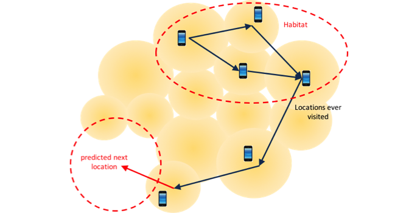

# Ellipsiz Communications Big Data Solutions

CDR (or XDR generated by probes) is the valuable data source in telecom operator to analyze the behavior of their subscribers and can be converted to the _**market intelligence**_ for _**monetization**_.

As [Ellipsiz Communications](http://www.ellipsiz-comms.com/index.html) is the CDR/XDR expert with past **15-year experience in telecom industry**, the business critical requirement we learned from our telco customers is to have the solutions to process the really huge volume of CDR/XDR either for **fast search** or for **intelligence analysis**. 

To respond customer’s requirement, Ellipsiz Communications has developed two solutions for CDR/XDR processing with modern big data technologies, 

- #### _**EC Blast**_ – fast CDR/XDR/Log search solution
    Billions of CDR/XDR/Log records are generated from the telecom network every day, no one record can be discarded and all of them have to be stored for future use, such as **troubleshooting for network issue or subscriber’s complaint**, **billing verification**, **subscriber filtering for marketing event**, **authority audit**, and so on. 

    Therefore, the tradition database approach is not suitable but a fast full text search engine is required in order to ***derive the result from huge volume of CDR/XDR/Log records in second***. 
    
    We developed the solution based on ***Lucene*** technology and the system can be expanded with network traffic growth or longer data storage time required.

    - Imported Data Traffic Monitoring View:
    

    - Data Query View
    
    
    - Data Query Result View
    

- #### ***EC BigData*** – Location prediction solution
Location is the key information in telecom CDR/XDR and more intelligence and applications can be derived from subscriber’s mobility. 

    Unlike other location based systems or applications, the solution we proposed is to predict the subscriber’s next location in near future and the regions he stays or visits more often (so-called **habitat**). 

    The location prediction can be extensively adopted in following domains:
    - ####Application samples of Next location prediction:
        -   Pre-alerting when subscriber is going to access the bad radio cell.
        -	Pre-arrangement of network resources when crowd is predicted somewhere
        -	Taxi driving suggestion when crowd is predicted somewhere.
        -	Location based advertising to attract the consumer before he arrives or change his original mind to the new destination.
        -	Abnormal route alerting when the elder or children goes the different route as usual.
        -	Others
    
    - ####Application samples of Habitat prediction:
        -	Location based adverting to the residents of the region or the visitors who come the region more often.
        -	Pre-alerting to the residents of the region or the visitors who come the region more often before some big event will be happened in the region.
        -	National security
        -	Others
        
    We developed the solution based on the big data technologies including ***Hadoop***, ***Spark***, ***machine learning***, and so on.

    - ####Location Prediction Concept:
    
    
    - ####Next Location Prediction Result:
    
