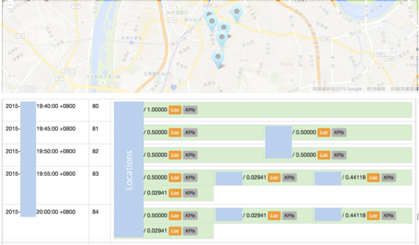

# ***EC BigData*** – Location prediction solution

###Location
Location is the key information in telecom CDR/XDR and more intelligence and applications can be derived from subscriber’s mobility. 

Unlike other location based systems or applications, the solution we proposed is to predict the subscriber’s next location in near future and the regions he stays or visits more often (so-called **habitat**). 

The location prediction can be extensively adopted in following domains:
- ####Application samples of Next location prediction:
    -   Pre-alerting when subscriber is going to access the bad radio cell.
-	Pre-arrangement of network resources when crowd is predicted somewhere
-	Taxi driving suggestion when crowd is predicted somewhere.
-	Location based advertising to attract the consumer before he arrives or change his original mind to the new destination.
-	Abnormal route alerting when the elder or children goes the different route as usual.
-	Others

- ###Application samples of Habitat prediction:
-	Location based adverting to the residents of the region or the visitors who come the region more often.
-	Pre-alerting to the residents of the region or the visitors who come the region more often before some big event will be happened in the region.
-	National security
-	Others

We developed the solution based on the big data technologies including ***Hadoop***, ***Spark***, ***machine learning***, and so on.

###Demo Views
- Location Prediction Concept:

- Next Location Prediction Result:
